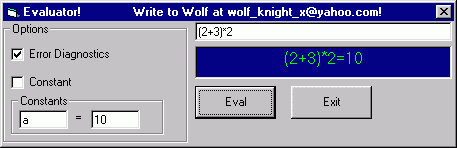



## Evaluate

### Description

Takes a string and evaluates it, thus giving the user an answer to a string such as "hsin(1)+hcos(1)", which will be e. The evaluator incorporates an error handler, as well as user entered constants. The function is in the module, easily made to be imported to other programs. A demonstration program is included an shows some possiblities. A help file is not included, but will be available by e-mail. An important point, to keep in mind, that almost all functions must be entered in form of sin(45). If a function has one argument, enter it like sin(45), otherwise, put first argument, function, second argument, as in 2+1.
 
### More Info
 
The user inputs are minimum. The user only has to enter the string. Optional arguments are to enable/disable the error handler, and include user-created constants.

Those that use TI graphing calculators will remember the way functions are used. To enter square root of nine, put in sqr(9). Sine of 45 is sin(45), and so on, with some exceptions. Standard two-argrument operants like +, are entered just like that, 2+4.

Returns the value of the string, and any errors. Depending on whether the error handler is enabled or not, a message box may pop up.

Error handler is not fully functional. That means that it doesn't give back very good responses. At this point, though, it will detect any error. No crashes were detected in the testing period of over eight weeks.

             |
---                |---
**Submitted On**   |2000-06-09 21:39:58
**By**             |[Maseraj](https://github.com/Planet-Source-Code/PSCIndex/blob/master/ByAuthor/maseraj.md)
**Level**          |Advanced
**User Rating**    |4.3 (26 globes from 6 users)
**Compatibility**  |VB 3\.0, VB 4\.0 \(16\-bit\), VB 4\.0 \(32\-bit\), VB 5\.0, VB 6\.0, VB Script, ASP \(Active Server Pages\) 
**Category**       |[String Manipulation](https://github.com/Planet-Source-Code/PSCIndex/blob/master/ByCategory/string-manipulation__1-5.md)
**World**          |[Visual Basic](https://github.com/Planet-Source-Code/PSCIndex/blob/master/ByWorld/visual-basic.md)
**Archive File**   |[CODE\_UPLOAD6600692000\.zip](https://github.com/Planet-Source-Code/maseraj-evaluate__1-8778/archive/master.zip)

